# Resto Sedap - Restaurant Reservation & Management System

A full-stack Restaurant Management and Reservation System built with Laravel 12, Bootstrap 5, and Microsoft SQL Server (MSSQL). Designed to streamline table bookings, multi-item menu pre-ordering, customer tracking, automated blacklist monitoring, and operational reporting.

---

## Application Preview

### 1. Dashboard Utama
Ringkasan statistik operasional: total reservasi, pelanggan terdaftar, jumlah blacklist, total pendapatan, daftar pelanggan teraktif, dan jadwal reservasi harian.
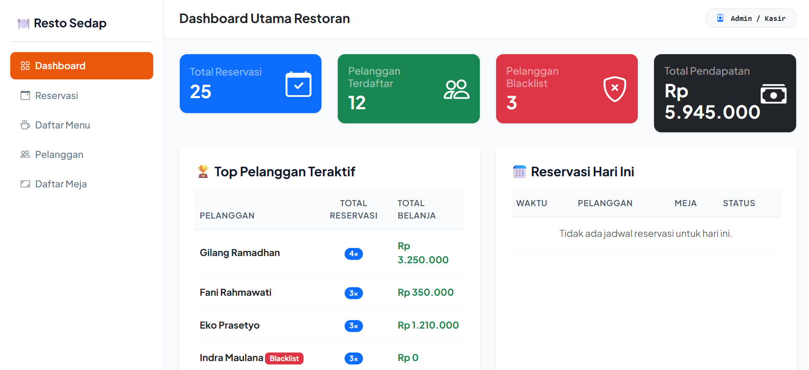

---

### 2. Manajemen Reservasi & Transaksi
Pencatatan reservasi real-time, filter status (Semua, Waktu Terdekat, Dibatalkan, Blacklist), serta fitur ekspor laporan ke format Excel, PDF, dan Print.
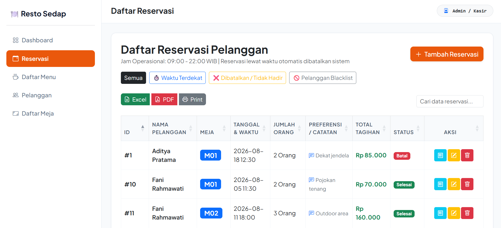

* **Tambah Reservasi & Multi-Menu Pre-Order:**
  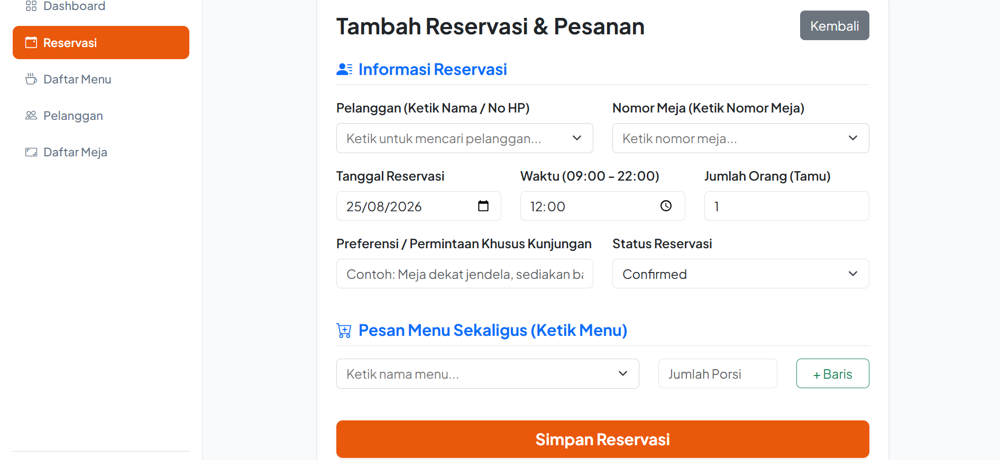

* **Edit & Update Status Reservasi:**
  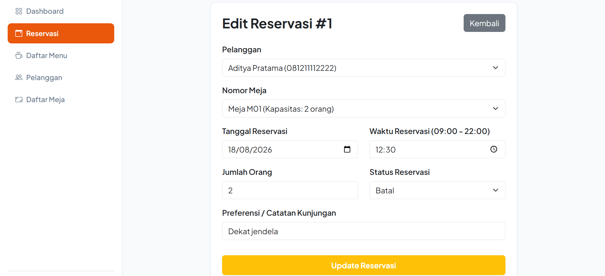

---

### 3. Master Data Pelanggan & Deteksi Blacklist
Pelacakan riwayat reservasi pelanggan dan deteksi otomatis status Normal vs Blacklist untuk memitigasi risiko pembatalan sepihak (no-show).
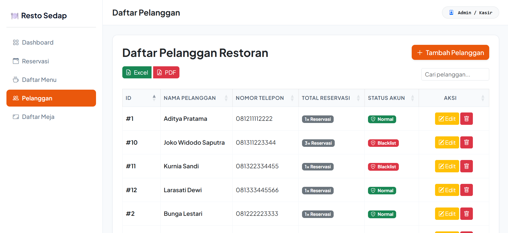
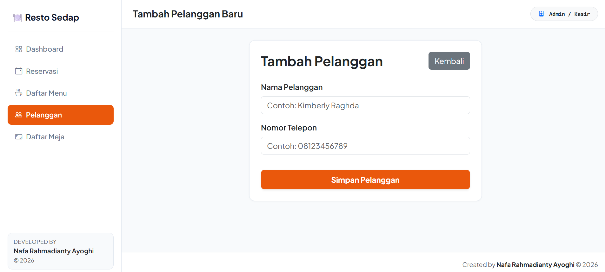

---

### 4. Master Data Menu & Manajemen Meja
Pengelolaan katalog makanan/minuman berdasarkan kategori harga, serta pengaturan kapasitas dan ketersediaan meja restoran.
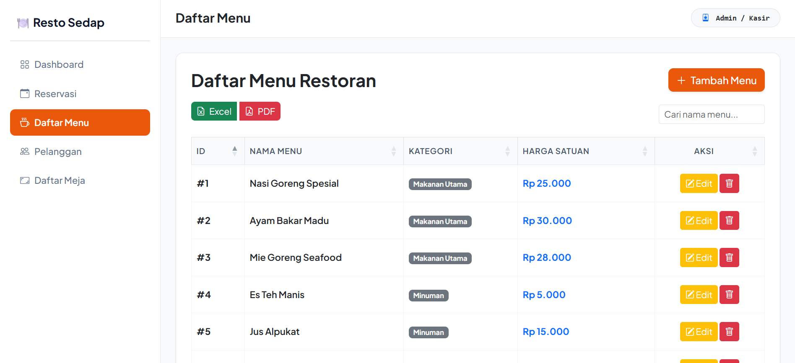
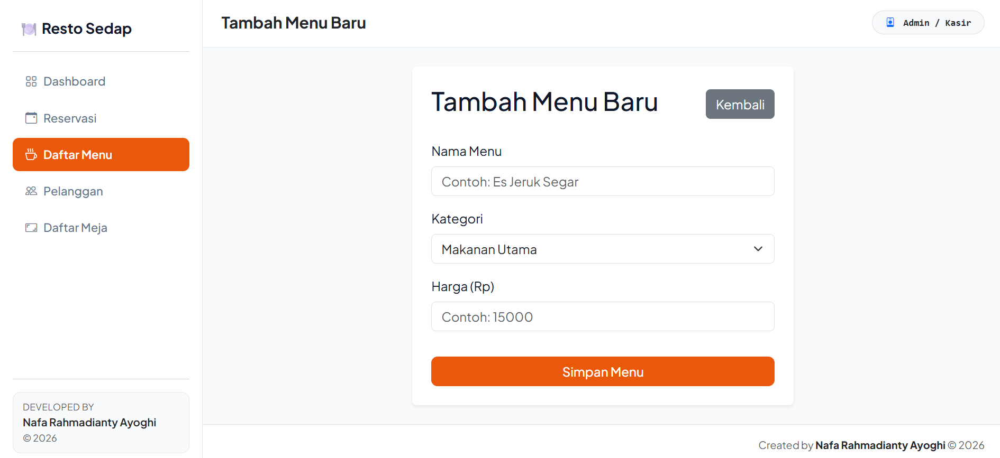
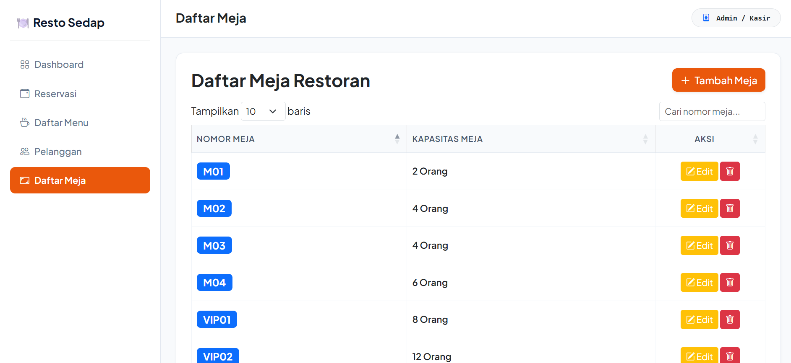
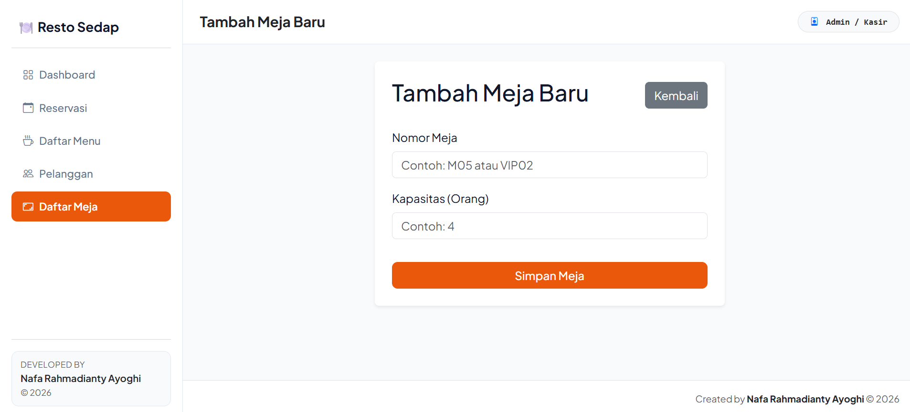

---

### 5. Ekspor & Cetak Laporan Operasional
Fitur pratinjau cetak (print preview) laporan transaksi dan reservasi yang siap dikirim langsung ke printer fisik atau diunduh sebagai file PDF.
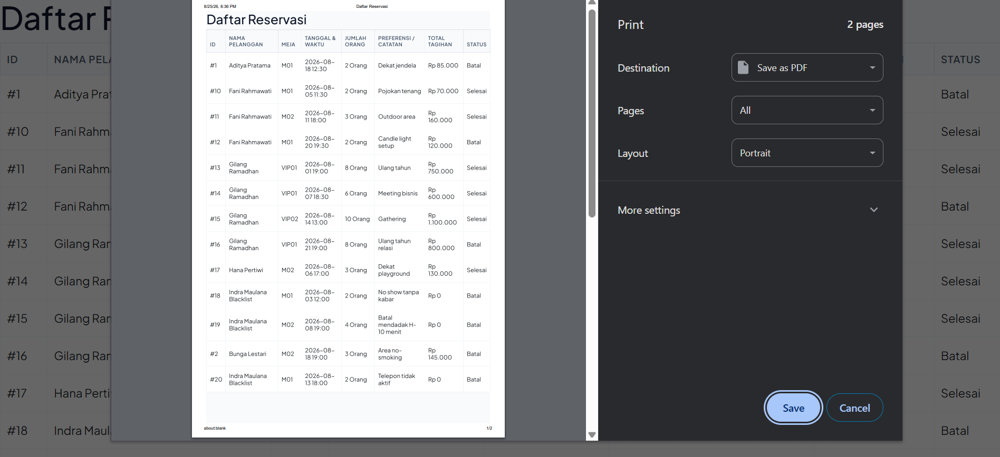

---

## Pemodelan Basis Data (Database Architecture)

Sistem ini dirancang menggunakan dua tahap pemodelan relasional di PowerDesigner dan diimplementasikan pada Microsoft SQL Server.

### 1. Conceptual Data Model (CDM)
CDM menggambarkan struktur konsep data, relasi logis, serta kardinalitas antarentitas dalam sistem operasional restoran tanpa terikat oleh struktur DBMS tertentu.

**Entitas dan Aturan Relasi (Kardinalitas):**
* **`pelanggan` — `reservasi` (membuat):** Relasi One-to-Many (1:N). Satu pelanggan dapat membuat banyak riwayat transaksi reservasi.
* **`meja` — `reservasi` (dipesan dalam):** Relasi One-to-Many (1:N). Satu meja fisik dapat digunakan pada banyak sesi reservasi di waktu berbeda.
* **`reservasi` — `detail_pesanan` (memiliki):** Relasi One-to-Many (1:N). Satu transaksi reservasi dapat menampung pemesanan beberapa jenis menu (pre-order).
* **`menu` — `detail_pesanan` (berisi):** Relasi One-to-Many (1:N). Satu item menu dapat terdaftar di berbagai transaksi reservasi yang berbeda.

---

### 2. Physical Data Model (PDM)
PDM merupakan implementasi fisik tabel relasional pada SQL Server dengan penentuan tipe data, Primary Key (`<pk>`), dan Foreign Key (`<fk>`).

**Struktur Relasi & Kunci (Keys):**
* **Tabel `reservasi`:**
  * `id_reservasi` sebagai Primary Key (`<pk>`).
  * `id_pelanggan` sebagai Foreign Key (`<fk1>`) mereferensikan tabel `pelanggan`.
  * `nomor_meja` sebagai Foreign Key (`<fk2>`) mereferensikan tabel `meja`.
* **Tabel `detail_pesanan` (Junction Table):**
  * Bertindak sebagai tabel detail/penghubung untuk mencatat rincian transaksi pemesanan item makanan/minuman (`jumlah`, `harga_satuan`, `subtotal`).
  * Terhubung via Foreign Key ke `reservasi` dan `menu`.

---

## Fitur Utama

- **Real-Time Analytics Dashboard:** Visualisasi metrik pendapatan, volume reservasi, dan daftar pelanggan teraktif.
- **Smart Booking & Pre-Order System:** Reservasi meja dengan integrasi pemesanan banyak menu makanan/minuman sekaligus.
- **Customer Reputation Tracking:** Identifikasi dan manajemen status pelanggan (Normal vs Blacklist) untuk mencegah no-show.
- **Export & Reporting Module:** Ekspor data operasional instan ke format Excel (.xlsx), PDF, dan Print Ready View.
- **Data Integrity & Relational Design:** Integritas referensial berbasis SQL Server dengan skema normalisasi yang konsisten.

---

## Tech Stack

- **Backend Framework:** Laravel 12 (PHP 8.2+)
- **Database Engine:** Microsoft SQL Server (MSSQL) / ODBC Driver 17
- **Frontend & UI:** Blade Templating Engine, Bootstrap 5, FontAwesome
- **Data Modeling Tool:** SAP PowerDesigner (CDM & PDM)
- **Libraries:** DataTables, Carbon (Date/Time Processing)

---

## Panduan Instalasi Lokal

1. **Clone Repositori:**
   - Jalankan: `git clone https://github.com/nafaayoghi/restoran-app.git`
   - Masuk ke folder: `cd restoran-app`

2. **Install Dependensi PHP:**
   - Jalankan: `composer install`

3. **Konfigurasi Environment Database:**
   - Salin file `.env.example` menjadi `.env`
   - Sesuaikan konfigurasi koneksi SQL Server berikut:
     - `DB_CONNECTION=sqlsrv`
     - `DB_HOST=127.0.0.1`
     - `DB_PORT=1433`
     - `DB_DATABASE=restoran`
     - `DB_USERNAME=sa`
     - `DB_PASSWORD=your_password`

4. **Generate Application Key & Migrasi:**
   - Jalankan: `php artisan key:generate`
   - Jalankan: `php artisan migrate --seed`

5. **Jalankan Server Lokal:**
   - Jalankan: `php artisan serve`
   - Buka browser pada alamat: `http://127.0.0.1:8000`

---

## Author
**Nafa Rahmadianty Ayoghi**  
Department of Mathematics, Faculty of Science and Data Analytics (FSAD)  
Institut Teknologi Sepuluh Nopember (ITS)  
2026 Resto Sedap. All Rights Reserved.